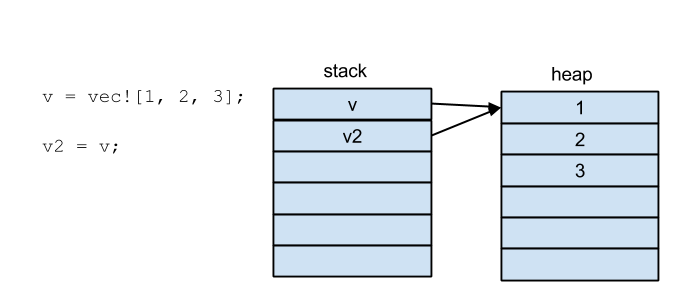

class: center middle
# Ownership of Rust
### Rust of Us - Chapter 3
### @tanaka51

---

name: summary

# Ownership 3行で

.big-list[
- 参照をコピーしたら、コピー元が使えなくなる機能
  - これを Ownership が移動した(moved)という
- 関数の引数として渡しても同じく移動する
  - 戻り値で元の値を返して、呼び出し側が受け取れば Ownership も戻る
- Copy トレイトを実装した型は Ownership が **移動しない** (値をまるっとコピーするから)
]

---

# 具体例1

コンパイルエラーになる:
```rust
v = vec![1, 2, 3];

v2 = v; // ここでオーナーシップが移動する

println!("v[0] is: {}", v[0]);
```

```none
error: use of moved value: `v`
println!("v[0] is: {}", v[0]);
                        ^
```

---

# 具体例2

関数呼び出しでもコンパイルエラーになる:

```rust
fn take(v: Vec<i32>) {
    // ここで起きることは重要じゃない
}

let v = vec![1, 2, 3];

take(v); // ここでオーナーシップが移動する

println!("v[0] is: {}", v[0]); // さっきと同じエラーが発生
```

---

# 具体例3

オーナーシップは、戻り値として返せば戻せる:

```rust
fn take(v: Vec<i32>) -> Vec(i32) {
    // ここで起きることは重要じゃない

    v
}

let v = vec![1, 2, 3];

v = take(v); // ここでオーナーシップが移動して、また戻ってくる

println!("v[0] is: {}", v[0]); // エラーは発生しない
```

---

# 具体例4

Copy トレイトを実装した型(ここでは `i32`)ではエラーにならない:

```rust
let v = 1;

let v2 = v;

println!("v is: {}", v); // エラーは発生しない
```

---

# Ownership がなぜ必要か

## => セグフォを防ぐため



この状態になると、`v` と `v2` どちらかが heap 領域を変更すると、もう片方にも影響が出てしまう。
同時にアクセスすると大変危険。

---

# しかし、そのせいでコードがグチャッとしてしまう

```rust
(v1: Vec<i32>, v2: Vec<i32>) -> (Vec<i32>, Vec<i32>, i32) {
    // v1 と v2 に何かする

    // オーナーシップを戻しつつ、関数の戻り値も返す
    (v1, v2, 42)
}

let v1 = vec![1, 2, 3];
let v2 = vec![1, 2, 3];

let (v1, v2, answer) = foo(v1, v2);
```

## => Rust は borrow という仕組みで解決した

---

template: summary

煩雑になる部分は、borrow という仕組みで解決される。
